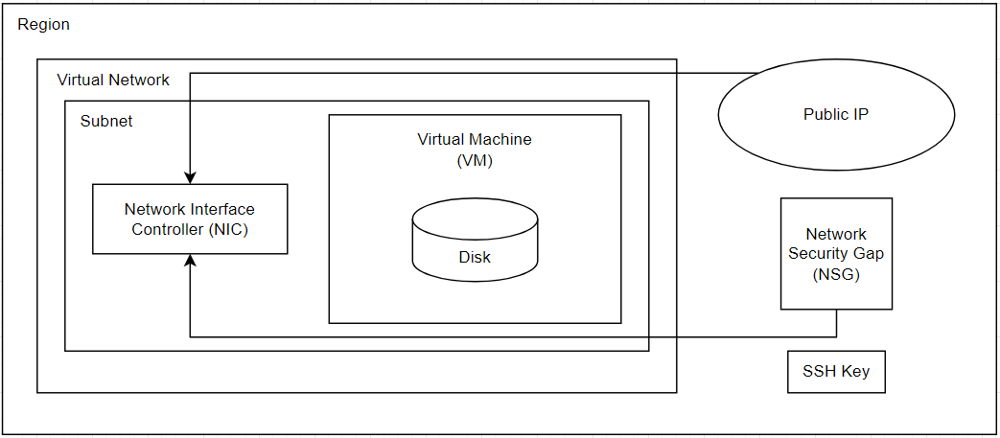

- [Virtual Machine Network Diagram](#virtual-machine-network-diagram)
- [Steps to Create a Virtual Network and a New SSH Key Pair in Azure](#steps-to-create-a-virtual-network-and-a-new-ssh-key-pair-in-azure)
  - [1. Creating a Virtual Network (VNet) in Azure](#1-creating-a-virtual-network-vnet-in-azure)
    - [What is a Virtual Network (VNet)?](#what-is-a-virtual-network-vnet)
    - [Steps to Create a Virtual Network](#steps-to-create-a-virtual-network)
  - [2. Creating a New SSH Key Pair for Azure Virtual Machines](#2-creating-a-new-ssh-key-pair-for-azure-virtual-machines)
    - [What is an SSH Key Pair?](#what-is-an-ssh-key-pair)
    - [Steps to Create an SSH Key Pair (Using GitBash)](#steps-to-create-an-ssh-key-pair-using-gitbash)
- [Plan to create a Virtual Machine](#plan-to-create-a-virtual-machine)
- [How to Create a Virtual Machine (VM)](#how-to-create-a-virtual-machine-vm)
  - [--\> Basics](#---basics)
  - [--\> Disks](#---disks)
  - [--\> Networking](#---networking)
  - [--\> Tags](#---tags)
  - [--\> Review and Create](#---review-and-create)
- [How to Stop Your Virtual Machine](#how-to-stop-your-virtual-machine)
- [Connecting Your Virtual Machine](#connecting-your-virtual-machine)
- [Some Linux Commands](#some-linux-commands)


# Virtual Machine Network Diagram



**NSG Rule – Allow SSH**
Allows inbound SSH traffic (port 22) for remote management of the VM.

**Virtual Network (VNet)**
Provides secure communication between VMs and other resources, acting as a private cloud network.

**Subnet**
A segment within the VNet for organizing and isolating VMs that can communicate internally.

**Resource Group**
A container to manage and organize related Azure resources like VMs and storage.

**Disk**
Storage assigned to the VM, including the OS disk and optional data disks.

**Public IP**
Makes the VM accessible from the internet via SSH or HTTP.

**NSG Rule – Allow HTTP**
Allows inbound HTTP traffic (port 80) for web server access.
Region

The geographic location where the VM and resources are hosted.

**SSH Key**
A secure authentication method for connecting to the VM, without needing a password.

**Network Interface Controller (NIC)**
Connects the VM to the VNet for internal and external network communication.

**Virtual Machine (VM)**
The core component that runs your applications, simulating a physical computer.

**Network Security Group (NSG)**
A virtual firewall that controls inbound and outbound traffic to the VM with security rules.


# Steps to Create a Virtual Network and a New SSH Key Pair in Azure

## 1. Creating a Virtual Network (VNet) in Azure

### What is a Virtual Network (VNet)?
A Virtual Network (VNet) in Azure allows resources like virtual machines (VMs), databases, and applications to securely communicate with each other, the internet, and other networks.


### Steps to Create a Virtual Network

1. **Create the Virtual Network:**
   - Go to "Virtual Networks" in the Azure Portal.
   - Click `+ Create` at the top of the page.

2. **Configure Basic Settings:**
   - **Subscription**: Choose the correct subscription.
   - **Resource Group**: Select the resource group you created earlier.
   - **Name**: Enter a name for your virtual network. (e.g tech264-..)
   - **Region**: Select UK South.

3. **Configure IP Addresses:**
   - Go to the "IP Addresses" tab.
   - Define the **Address Space** (default is a /16 CIDR block, e.g., `10.0.0.0/16`).
   - Under **Subnets**, click `+ Add subnet` to create subnets for the VNet (e.g., a default subnet `10.0.2.0/24` (256 addresses)).
   -  Under **Subnets**, click `+ Add subnet` to create a private subnet for the VNet (e.g., a private subnet `10.0.3.0/24` (256 addresses)).

4. **Configure Security:**
   - Go to the "Security" tab to enable any specific security features (We do not need to write anything in our case).

5. ***Tags:**
   - Name : Owner
   - Value : Your name

6. **Review and Create:**
   - Click `Review + Create` to validate the configuration.
   - If validation passes, click `Create`.

7. **Deployment:**
   - Wait for the VNet deployment to finish. Once deployed, you can manage the VNet through the Azure Portal.
  
  

## 2. Creating a New SSH Key Pair for Azure Virtual Machines

### What is an SSH Key Pair?
An SSH key pair consists of a public and private key used to authenticate access to virtual machines securely.

### Steps to Create an SSH Key Pair (Using GitBash)

1. **Open a Terminal:**
   1. Open GitBash
   2. Go to home directory using `cd`.
   3. Use `mkdir .ssh` to create a directory for SSH keys (Once done, doesn't need to be done again) when you're in your home directory. If it already exists, you can, `cd -ssh` into it.

2. **Generate SSH Key Pair:**
   Use the following command to generate an SSH key pair:

   ```
   ssh-keygen -t rsa -b 4096 -C "your_email@example.com"
   ```

`-t rsa`: Specifies the type of key to create (RSA).

`-b 4096`: Sets the key size to 4096 bits.

`-C`: Adds a comment (optional) to identify the key, often your email address.


3. **Save the SSH Key Pair:**
 - After running the command, you’ll be prompted to specify a location to save the key. Press Enter to save it in the default location.
 - You can choose to add a passphrase for extra security or leave it blank.

4. **View the SSH Public Key:**

To view and copy the public key, run:

```
cat ~/.ssh/example_key_name.pub
```

You can then paste this into your SSH key.

# Plan to create a Virtual Machine
- Virtual Network + Subnet
- Name
- Location, effects pricing
- Size, effects pricing
- Storage, effects pricing
- Operating system, could effect pricing
- SSH key pair

# How to Create a Virtual Machine (VM)

## --> Basics
1. **Search** for Virtual Machine on the Azure Portal. Create a new VM.
2. **Assign** resource group `(tech264)`.
3. **Name** the VM (e.g tech264-name...)
4. Set **region** to `(Europe) UK South`.
5. Change **availability** to "No infrastructure redudancy required".
6. Change **image** to the OS we want on the disc (Also includes flavour and version of the OS, with stuff installed and ready to run - Basically a snapshot of a system). In our case, select `Ubuntu Pro 18.04 - x64 Gen2`. If it is not visible in the immediate recent, click "See all images" and search for it.
7. Change **security type** to standard. 
8. Change **size** to `Standard_Bs1 - 1 vcpu, 1 GiB memory`. Select "see all sizes" if not seen in immediate recent.
9. Change **username** to to something more secure.
10. Change SSH public key source to `Use existing key stored in Azure`.
11. Select **your** Stored key (e.g tech264..).
12. Select `HTTP (80)` under **select inbound ports**. Both `SHH (22)` and `HTTP (80)` should be selected. You need to set up a certificate to use `HHTPS (443)`.

## --> Disks
1. Change OS Disk type to `Standard SSD (locally redundant storage)`.

## --> Networking
1. Change the **virtual network** to your own one, as it will default alphabetically.
2. Change **subnet** to `public-subnet`.
3. Enable **Delete public IP and NIC when VM is deleted**. Automates this just in case you forget to do it yourself.

## --> Tags
1. Select `Owner : (your name)`.

## --> Review and Create
1. Make sure all your details are correct.
2. Once you click create, it will deploy until completion. 

# How to Stop Your Virtual Machine
1. Go to your **resource**.
2. **Status** should read as "Running". 
3. Click "Stop".
4. It will give you a warning, select "yes". The virtual machine will begin stopping. 

# Connecting Your Virtual Machine
1. **Start** your virtual machine.
2. Navigate to "Connect" under your VM.
3. Find "Native SSH" and **select** it. A side panel should open. 
4. Input `~/.ssh/` and your `private key name` into the "Copy and Execute SSH Command" line. This will output a command for us to use in our CL (We are using **GitBash**).
5. Click the copy button for the code below what was just inputted.
6. Paste this code into your **GitBash**.
7. A **warning** will appear once entered into your **GitBash**. Respond with `yes` and then it will permanently save the IP address, meaning we will not be given the warning again.
8. You can type `exit` to **logout** of the Virtual Machine. 
