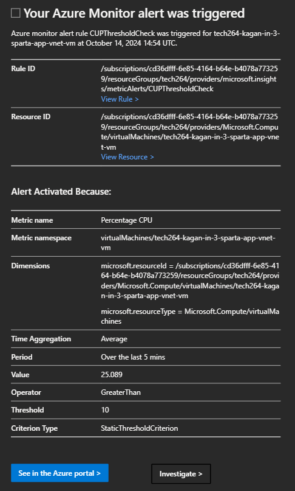

- [The basics of Azure](#the-basics-of-azure)
  - [Azure regions and availability zones: how they work and include up-to-date diagrams to help](#azure-regions-and-availability-zones-how-they-work-and-include-up-to-date-diagrams-to-help)
  - [How is Azure structured/organised?](#how-is-azure-structuredorganised)
  - [What types of services does Azure provide?](#what-types-of-services-does-azure-provide)
  - [Ways to access Azure?](#ways-to-access-azure)
  - [Explain the difference between Azure and Azure DevOps](#explain-the-difference-between-azure-and-azure-devops)
  - [Why use the Azure Pricing Calculator?](#why-use-the-azure-pricing-calculator)
- [Virtual Machine Network Diagram](#virtual-machine-network-diagram)
- [Steps to Create a Virtual Network and a New SSH Key Pair in Azure](#steps-to-create-a-virtual-network-and-a-new-ssh-key-pair-in-azure)
  - [1. Creating a Virtual Network (VNet) in Azure](#1-creating-a-virtual-network-vnet-in-azure)
    - [What is a Virtual Network (VNet)?](#what-is-a-virtual-network-vnet)
    - [Steps to Create a Virtual Network](#steps-to-create-a-virtual-network)
  - [2. Creating a New SSH Key Pair for Azure Virtual Machines](#2-creating-a-new-ssh-key-pair-for-azure-virtual-machines)
    - [What is an SSH Key Pair?](#what-is-an-ssh-key-pair)
    - [Steps to Create an SSH Key Pair (Using GitBash)](#steps-to-create-an-ssh-key-pair-using-gitbash)
- [Plan to create a Virtual Machine](#plan-to-create-a-virtual-machine)
- [How to Create a Virtual Machine (VM)](#how-to-create-a-virtual-machine-vm)
  - [--\> Basics](#---basics)
  - [--\> Disks](#---disks)
  - [--\> Networking](#---networking)
  - [--\> Tags](#---tags)
  - [--\> Review and Create](#---review-and-create)
- [How to Stop Your Virtual Machine](#how-to-stop-your-virtual-machine)
- [Connecting Your Virtual Machine](#connecting-your-virtual-machine)
- [How to add a port](#how-to-add-a-port)
- [The first two commands you run when you first start your VM](#the-first-two-commands-you-run-when-you-first-start-your-vm)
- [Deleting Your Virtual Machine](#deleting-your-virtual-machine)
- [SSH Security](#ssh-security)
- [Create an Image](#create-an-image)
- [How you setup a dashboard](#how-you-setup-a-dashboard)
- [How to counteract High CPU Load](#how-to-counteract-high-cpu-load)
- [Scaling a VM](#scaling-a-vm)
- [Architecture for an Azure VM Scale Set](#architecture-for-an-azure-vm-scale-set)
- [Creating a VM scale set](#creating-a-vm-scale-set)
  - [--\> Basics](#---basics-1)
  - [--\> Disks](#---disks-1)
  - [--\> Networking](#---networking-1)
  - [--\> Health](#---health)
  - [--\> Advanced](#---advanced)
  - [--\> Tags](#---tags-1)
  - [--\> Review and Create](#---review-and-create-1)
- [How to delete a scale set](#how-to-delete-a-scale-set)
- [What is a load balancer and why is it needed?](#what-is-a-load-balancer-and-why-is-it-needed)
- [How to create an unhealthy instance (for testing) and why it is marked as healthy/unhealthy](#how-to-create-an-unhealthy-instance-for-testing-and-why-it-is-marked-as-healthyunhealthy)
    - [Healthy Instance:](#healthy-instance)
    - [Unhealthy Instance:](#unhealthy-instance)
- [How to SSH into an instance](#how-to-ssh-into-an-instance)
- [Creating a dashboard](#creating-a-dashboard)
- [How did load testing and the dashboard combined help us?](#how-did-load-testing-and-the-dashboard-combined-help-us)
  - [Allows you to identify performance issues](#allows-you-to-identify-performance-issues)
  - [Monitoring Auto-Scale and Load Distribution](#monitoring-auto-scale-and-load-distribution)
  - [Ensures high availability](#ensures-high-availability)
- [Creating an unhealthy instance in my dashboard](#creating-an-unhealthy-instance-in-my-dashboard)
- [Creating an alert rule](#creating-an-alert-rule)
    - [--\> Condition](#---condition)
    - [--\> Actions](#---actions)
    - [--\> Details](#---details)
    - [--\> Notifications](#---notifications)
    - [--\> Tags](#---tags-2)
    - [--\> Review and Create](#---review-and-create-2)
  - [Triggering this alert rule.](#triggering-this-alert-rule)
- [Re-create the 3-subnet architecture to make the database private](#re-create-the-3-subnet-architecture-to-make-the-database-private)
  - [Set up the Virtual Network](#set-up-the-virtual-network)
    - [--\> Basics](#---basics-2)
    - [--\> IP addresses](#---ip-addresses)
    - [--\> Tags](#---tags-3)
    - [--\> Review and Create](#---review-and-create-3)
  - [Create Database VM](#create-database-vm)
    - [--\> Basics](#---basics-3)
    - [--\> Review and Create](#---review-and-create-4)
  - [Create the App VM](#create-the-app-vm)
    - [--\> Basics](#---basics-4)
    - [--\> Networking](#---networking-2)
    - [--\> Advanced](#---advanced-1)
    - [--\> Review and Create](#---review-and-create-5)
  - [Create a virtual machine for the NVA](#create-a-virtual-machine-for-the-nva)
    - [--\> Basics](#---basics-5)
    - [--\> Networking](#---networking-3)
    - [--\> Review and Create](#---review-and-create-6)
  - [Route Tables](#route-tables)
    - [--\> Review and Create](#---review-and-create-7)
    - [--\> Routes under Settings](#---routes-under-settings)
    - [--\> Subnet under Settings](#---subnet-under-settings)
    - [TO BE CONTINUED...](#to-be-continued)
- [What is an availability set? How do they work? Advantages/disadvantages?](#what-is-an-availability-set-how-do-they-work-advantagesdisadvantages)
- [What is an availability zone? Why superior to an availability set? Disadvantages?](#what-is-an-availability-zone-why-superior-to-an-availability-set-disadvantages)
- [What is a Virtual Machine Scale Set? What type of scaling does it do? How does it work? Limitations?](#what-is-a-virtual-machine-scale-set-what-type-of-scaling-does-it-do-how-does-it-work-limitations)

# The basics of Azure

## Azure regions and availability zones: how they work and include up-to-date diagrams to help

- **Regions**: Azure is divided into geographic **regions**, each containing one or more **data centers**. These **regions** are designed to provide** redundancy** and **high availability**, enabling **users** to choose a location closest to their users for optimal performance.
- **Availability Zones**: These are separate physical locations within a **region**, designed to be **isolated from failures** in other zones. Each zone has independent power, cooling, and networking, which increases resilience against outages.


## How is Azure structured/organised?
- **Resource Groups**: Logical containers for Azure resources (VMs, databases, etc.) to manage permissions and policies collectively.
- Subscriptions: Represents a billing entity; a user can have multiple subscriptions to manage costs and resources separately.
- **Management Groups**: Allows organization of multiple subscriptions for governance and management.

## What types of services does Azure provide?
**Compute**:
- Virtual Machines
- Azure Functions (serverless)
- App Services

**Storage**:
- Azure Blob Storage
- Azure File Storage
- Azure Queue Storage

**Networking**:
- Virtual Network
- Azure Load Balancer
- Azure VPN Gateway

**Databases**:
- Azure SQL Database
- Azure Cosmos DB
- Azure Database for PostgreSQL

**AI and Machine Learning**:
- Azure Machine Learning
- Cognitive Services

**DevOps**:
- Azure DevOps (including Repos, Pipelines, Boards)

**Security and Identity**:
- Azure Active Directory
- Azure Security Center

## Ways to access Azure?
- **Azure Portal**: A web-based interface for managing Azure services and resources.
- **Azure CLI**: A command-line tool for managing Azure resources from the terminal.
- **Azure PowerShell**: A set of cmdlets for managing Azure resources using PowerShell.
- **REST API**: For programmatic access to Azure services.
- **Azure SDKs**: Libraries for various programming languages to build applications that integrate with Azure.
## Explain the difference between Azure and Azure DevOps
**Azure**: A comprehensive cloud computing platform offering a wide range of services for building, deploying, and managing applications.

**Azure DevOps**: A suite of development tools and services designed for software development, including:
- Azure Repos (source control)
- Azure Pipelines (CI/CD)
- Azure Boards (project management)
## Why use the Azure Pricing Calculator?
The Azure Pricing Calculator helps users estimate the cost of using Azure services by:
- **Budgeting**: **Users** can input their expected usage to understand potential costs.
- **Comparing** Services: It allows **users** to compare the costs of different services and configurations.
- **Customization**: **Users** can tailor the calculator to their specific needs and scenarios, making it easier to plan and manage budgets.

# Virtual Machine Network Diagram


**NSG Rule – Allow SSH**
Allows inbound SSH traffic (port 22) for remote management of the VM.

**Virtual Network (VNet)**
Provides secure communication between VMs and other resources, acting as a private cloud network.

**Subnet**
A segment within the VNet for organizing and isolating VMs that can communicate internally.

**Resource Group**
A container to manage and organize related Azure resources like VMs and storage.

**Disk**
Storage assigned to the VM, including the OS disk and optional data disks.

**Public IP**
Makes the VM accessible from the internet via SSH or HTTP.

**NSG Rule – Allow HTTP**
Allows inbound HTTP traffic (port 80) for web server access.
Region

The geographic location where the VM and resources are hosted.

**SSH Key**
A secure authentication method for connecting to the VM, without needing a password.

**Network Interface Controller (NIC)**
Connects the VM to the VNet for internal and external network communication.

**Virtual Machine (VM)**
The core component that runs your applications, simulating a physical computer.

**Network Security Group (NSG)**
A virtual firewall that controls inbound and outbound traffic to the VM with security rules.


# Steps to Create a Virtual Network and a New SSH Key Pair in Azure

## 1. Creating a Virtual Network (VNet) in Azure

### What is a Virtual Network (VNet)?
A Virtual Network (VNet) in Azure allows resources like virtual machines (VMs), databases, and applications to securely communicate with each other, the internet, and other networks.


### Steps to Create a Virtual Network

1. **Create the Virtual Network:**
   - Go to "Virtual Networks" in the Azure Portal.
   - Click `+ Create` at the top of the page.

2. **Configure Basic Settings:**
   - **Subscription**: Choose the correct subscription.
   - **Resource Group**: Select the resource group you created earlier.
   - **Name**: Enter a name for your virtual network. (e.g tech264-..)
   - **Region**: Select UK South.

3. **Configure IP Addresses:**
   - Go to the "IP Addresses" tab.
   - Define the **Address Space** (default is a /16 CIDR block, e.g., `10.0.0.0/16`).
   - Under **Subnets**, click `+ Add subnet` to create subnets for the VNet (e.g., a default subnet `10.0.2.0/24` (256 addresses)).
   -  Under **Subnets**, click `+ Add subnet` to create a private subnet for the VNet (e.g., a private subnet `10.0.3.0/24` (256 addresses)).

4. **Configure Security:**
   - Go to the "Security" tab to enable any specific security features (We do not need to write anything in our case).

5. ***Tags:**
   - Name : Owner
   - Value : Your name

6. **Review and Create:**
   - Click `Review + Create` to validate the configuration.
   - If validation passes, click `Create`.

7. **Deployment:**
   - Wait for the VNet deployment to finish. Once deployed, you can manage the VNet through the Azure Portal.
  


## 2. Creating a New SSH Key Pair for Azure Virtual Machines

### What is an SSH Key Pair?
An SSH key pair consists of a public and private key used to authenticate access to virtual machines securely.

### Steps to Create an SSH Key Pair (Using GitBash)

1. **Open a Terminal:**
   1. Open GitBash
   2. Go to home directory using `cd`.
   3. Use `mkdir .ssh` to create a directory for SSH keys (Once done, doesn't need to be done again) when you're in your home directory. If it already exists, you can, `cd -ssh` into it.

2. **Generate SSH Key Pair:**
   Use the following command to generate an SSH key pair:

   ```
   ssh-keygen -t rsa -b 4096 -C "your_email@example.com"
   ```

`-t rsa`: Specifies the type of key to create (RSA).

`-b 4096`: Sets the key size to 4096 bits.

`-C`: Adds a comment (optional) to identify the key, often your email address.


3. **Save the SSH Key Pair:**
 - After running the command, you’ll be prompted to specify a location to save the key. Press Enter to save it in the default location.
 - You can choose to add a passphrase for extra security or leave it blank.

4. **View the SSH Public Key:**

To view and copy the public key, run:

```
cat ~/.ssh/example_key_name.pub
```

You can then paste this into your SSH key.

# Plan to create a Virtual Machine
- Virtual Network + Subnet
- Name
- Location, effects pricing
- Size, effects pricing
- Storage, effects pricing
- Operating system, could effect pricing
- SSH key pair

# How to Create a Virtual Machine (VM)

## --> Basics
1. **Search** for Virtual Machine on the Azure Portal. Create a new VM.
2. **Assign** resource group `(tech264)`.
3. **Name** the VM (e.g tech264-name...)
4. Set **region** to `(Europe) UK South`.
5. Change **availability** to "No infrastructure redudancy required".
6. Change **image** to the OS we want on the disc (Also includes flavour and version of the OS, with stuff installed and ready to run - Basically a snapshot of a system). In our case, select `Ubuntu Pro 22.04 - x64 Gen2`. If it is not visible in the immediate recent, click "See all images" and search for it.
7. Change **security type** to standard. 
8. Change **size** to `Standard_Bs1 - 1 vcpu, 1 GiB memory`. Select "see all sizes" if not seen in immediate recent.
9. Change **username** to to something more secure.
10. Change SSH public key source to `Use existing key stored in Azure`.
11. Select **your** Stored key (e.g tech264..).
12. Select `HTTP (80)` under **select inbound ports**. Both `SHH (22)` and `HTTP (80)` should be selected. You need to set up a certificate to use `HHTPS (443)`.

## --> Disks
1. Change OS Disk type to `Standard SSD (locally redundant storage)`.

## --> Networking
1. Change the **virtual network** to your own one, as it will default alphabetically.
2. Change **subnet** to `public-subnet`.
3. Enable **Delete public IP and NIC when VM is deleted**. Automates this just in case you forget to do it yourself.

## --> Tags
1. Select `Owner : (your name)`.

## --> Review and Create
1. Make sure all your details are correct.
2. Once you click create, it will deploy until completion. 

# How to Stop Your Virtual Machine
1. Go to your **resource**.
2. **Status** should read as "Running". 
3. Click "Stop".
4. It will give you a warning, select "yes". The virtual machine will begin stopping. 

# Connecting Your Virtual Machine
1. **Start** your virtual machine.
2. Navigate to "Connect" under your VM.
3. Find "Native SSH" and **select** it. A side panel should open. 
4. Input `~/.ssh/` and your `private key name` into the "Copy and Execute SSH Command" line. This will output a command for us to use in our CL (We are using **GitBash**).
5. Click the copy button for the code below what was just inputted.
6. Paste this code into your **GitBash**.
7. A **warning** will appear once entered into your **GitBash**. Respond with `yes` and then it will permanently save the IP address, meaning we will not be given the warning again.
8. You can type `exit` to **logout** of the Virtual Machine. 

# How to add a port
1. Navigate to your VM's **network settings**.
2. Open up **Settings** and click **inbound security rules**.
3. Change the **destination port** to `3000`.
4. Change protocol to **TCP**.
5. Change the priority. The **lower** the priority, the **higher** the priority. 

# The first two commands you run when you first start your VM
1. `sudo apt update -y`
2. `sudo DEBIAN_FRONTEND=noninteractive apt-get upgrade -y`

# Deleting Your Virtual Machine
1. Navigate to overview.
2. Find your resource group.
3. Filter your name. You will see multiple items appear.
4. Tick `resourcegroupname-name-vmname`
5. Tick `resourcegroupname-vmname-ip`
6. Tick `resourcegroupname-vmname-nsg`
7. Tick `resourcegroupname-name-networkinterface`
8. Tick `resourcegroupname-name-Disk`
9. Locate **delete**. **AVOID** clicking **delete** for the **resource group**.
10. Tick "Apply force delete" just to be safe.
11. Enter "delete" in the input box and click **delete**.
12. Select **delete** once more to confirm **deletion**.

We leave the Virtual Network and SSH Key as they can be reused.

# SSH Security
Even though only you have your SSH key, people can still attempt to access your VM. Keeping your VM secure is important to prevent data breaches and other security issues. 

1. Navigate to **Network Settings**.
2. Locate **Inbound security rules** under **Settings**.
3. Find your SSH rule and change **Source** from **Any** to your own IP address 
to stop people from trying to access your VM.

However, when you turn off the VM, the IP will change. 

If we're not SSHing into it for a long time, we could...

1. Change access for **SSH** to **Deny**. This means NO ONE can get access.

# Create an Image

1. Select **Capture Image** on the VM of choice's **Overview**.
2. Under **Instance details**, Select **No, capture only a managed image**. 
3. Enable **Automatically delete this virtual machine after creating the image**.
4. Name image appropriately.
5. Run `sudo waagent -deprovision+user` inside our DB SSH to remove delete information we no longer need, then return to Azure window.
6. Add tags.
7. Review, then create.
-> type(private/pubic) -> Dashboard name-> Pin

# How you setup a dashboard
1. go to monitoring tab and pin the following:
   - **cpu average**
   - **disk bytes**
   - You can view more by clicking to option to view more metrics.
2. click the **pin** on the **CPU average**.
3. make a new, shared dashboard and fill in the details.
4. add network total and disk operations metrics onto the dashboard.
5. search dashboards at the top.
6. click your dashboard.

# How to counteract High CPU Load


# Scaling a VM


# Architecture for an Azure VM Scale Set


# Creating a VM scale set
A scale set lets you create and manage a group of load balanced VMs. The VMs are identical and automatically scaling.

## --> Basics 
1. Search "scale set" in the top search bar and click **virtual machine scale set**.
2. **Assign** resource group `(tech264)`.
3. **Name** the VM (e.g tech264-name...)
4. Set **region** to `(Europe) UK South`.
5. Select all 3 availability zones.
6. Under **orchestration mode**, select `uniform`.
7. Set the security type to `standard`.
8. For **scaling**, select `autoscaling`. A window will appear below it - click **configure**.
9. Select the pencil for the default condition to edit it.
10. Input **3** for the maximum instances / VMs.
11. Input **75** for the CPU threshold greater than. 
12. Select **Save**.
13. Once returned to the basics page, select "see all images".
14. Select "my images" and search for your image - then **select**.
9. Change **username** to something more secure.
10. Change SSH public key source to `Use existing key stored in Azure`.
11. Select **your** Stored key (e.g tech264..).

## --> Disks 
1. Change OS Disk type to `Standard SSD (locally redundant storage)`.

## --> Networking 
1. For the **Virtual network**, Select your subnet.
2. Edit your **Network Interface**.
3. Select allow selected ports, then enable `SSH(22)` and `HTTP(80)`.
4. Ensure public IP address is **disabled** as the load balancer will handle this now.
5. Apply those changes and you will be returned to the Networking screen.
6. Select **Create a load balancer**.
7. Change the name to your naming conventions with al "lb" on the end of it, to label it as a **load balancer**. 
8. Select **Create**. This will take up the "Select load balancer" slot.

## --> Health 
1. **Tick** the box labelled "Enable application health monitoring". 
2. **Tick** the box labelled "Automatic repairs".

## --> Advanced 
1. **Tick** the box "Enable user data" to allow an input and insert:
```bash
#!/bin/bash

echo "Change directory to app"
cd repo/app
echo "In app directory"

# Stop all existing pm2 processes
pm2 stop all

echo "start"
pm2 start app.js
echo "App started with pm2
```

## --> Tags 
1. Select owner and your name.

## --> Review and Create 
1. **Ensure** you've selected the correct options.
2. **Create** your shiny new VM scale set.

# How to delete a scale set
1. Go the **overview** tab.
2. Select **delete**, and enable the **force delete** option.

# What is a load balancer and why is it needed?

A load balancer is a system or device that distributes incoming network traffic across multiple servers (or other resources), ensuring no single server is overwhelmed. It acts as a "traffic manager," distributing client requests efficiently to multiple backend servers, also known as a server pool or server farm.

# How to create an unhealthy instance (for testing) and why it is marked as healthy/unhealthy
To create an unhealthy instance for testing in a load-balanced environment, you simulate conditions where a server fails to meet the health check criteria set by the load balancer. We could:
`sudo systemctl stop nginx` : Stop nginx from running.
`sudo ufw deny 80/tcp` : Block the port with a firewall rule.
- You could also stop and rerun the VM, because the app will not re-run again.
- You could SSH in the instance you want to be uneahlthy, go to the root directory and use `pm2 stop all`.

To make an unhealthy instance healthy again, we'd have to reimage the instance.

### Healthy Instance:

The instance is considered healthy if it responds to the health check with expected results. This typically includes:
- HTTP response code 200 (OK) from the health check URL.
- Successful connection to the specified TCP/UDP port.
- Expected output from a script.
- Healthy instances are included in the load balancer's pool and continue to receive traffic.

### Unhealthy Instance:

The instance is marked unhealthy if:
- It doesn't respond to the health check within the defined timeout period.
- It returns an HTTP status code like 500 (Internal Server Error) or doesn't return a 200 OK.
- The port being checked is not reachable.
- It fails custom health check criteria (e.g., a failed database connection or insufficient resources).
- Unhealthy instances are excluded from the load balancer's pool until they pass the health checks again.

# How to SSH into an instance

As you would normally grab the IP, you would need to find the public IP. As well as that, since the instance is now managed by a load balancer, the IP is different. 
Once we have the IP, we also need to use `-p` to label a port input for our SSH command, followed by the instance port number. This ranges between 50000 and 50002.

# Creating a dashboard
1. Navigate to **Dashboard Hub**.
2. Click **Create**.
3. Then on the **Tile Gallery**, select what you would like to see. 
4. You can also navigate to a resource, select **Monitoring** and pin data of your choosing.

# How did load testing and the dashboard combined help us?

## Allows you to identify performance issues
Load testing simulates high traffic to the application, meaning you can identify high CPU or memory usage easily.

## Monitoring Auto-Scale and Load Distribution
Azure provides auto-scaling services that spin up more instances when a load increases. The dashboard allows you to visualise load distrubition and track scaling events.

## Ensures high availability
Load testing helps ensure that the appliation remains available even under heavy load. We can use the dashboard's alerts to send alerts when certain thresholds are met.

If we have 3 availability regions and a minimum of 2 instances, we can ensure high availability. If one is up is region 1 and the other is up in region 2, if region 1 has a disaster, the traffic moves to the second machine. If we had a minimum of 1 instance, if it went down in region 1, we would have to wait for another instance to spin up in a different region, which leaves customers waiting.

# Creating an unhealthy instance in my dashboard

Navigate to your operating system tab under your scale set. Edit user data and commit out the `sudo pm2 start app.js` line. Then, delete one of the instances and when it remakes one, it will do so with the new user data - creating an unhealthy, unworking instance.


# Creating an alert rule
1. Select the VM you wish to add an alert to and navigate to **Monitoring**.
2. under "Alerts", you will ee a pop up to **enable** or **creatre alert rule**. Select **creatre alert rule**.

### --> Condition
1. For **Signal name**, select **Percentage CPU**.
2. Change the **Threshold** to your desired amount: **75**% in our case. 

### --> Actions 
1. Select **Create action group**.
2. Select **tech264** as the resource group. 
3. Name the action group appropriately.

### --> Details
1. Set the severity.
2. Add a rule name.

### --> Notifications
1. For **notification type**, select **Email/SMS/message/Push/Voice**.
2. Name it appropriately.
3. Select the pencil to edit details.
4. Enable **email**, and input your desired email.

### --> Tags
1. Select owner and your name.

### --> Review and Create
1. **Ensure** you've selected the correct options.
2. **Create** your shiny new alert rule.

## Triggering this alert rule.

I set the threshold to 10% for testing and used the following commands to trigger it:

```
# Install stress
sudo apt-get install stress

# Generate CPU load using stress
# This runs 4 workers that consume CPU for 300 seconds
stress --cpu 4 --timeout 300
```



# Re-create the 3-subnet architecture to make the database private


3 subnet architecure is more secure than 2 tier architecture as it adds a layer of securtiy and control. The DMZ subnet acts as an intermdiary between the public and private subnets. It contains NVAs such as load balancer or fiewall, which inspect traffic before allowing it to pass between the public and private subnets. Think of it as a doorman at a club. If the big fella doesn't like what he (or she, go girl) sees, he's not letting you in. 

## Set up the Virtual Network

### --> Basics
1. Name appropriately (tech264-name-in-3-subnet-vnet-db-vm)

### --> IP addresses
1. Edit **default subnet**, rename to **public-subnet** and change **starting address** to `10.0.1.0`.
2. Add a new subnet, rename to dmz-subnet and change **starting address** to `10.0.3.0`.
3. Add another new subnet for private subnet, rename to private-subnet and change **starting address** to` 10.0.4.0` and enable **private subnet**. This means that whatever you put in this subnet cannot access the internet.

### --> Tags 
1. Select owner and your name.

### --> Review and Create 
1. **Ensure** you've selected the correct options.
2. **Create** your shiny new secure virtual network.

## Create Database VM
Now we create a virtual machine using our database image. We start with the database as we follow the 2-tier architecture sructure.

Follow the usual **DATABASE** steps with these slight changes... 

### --> Basics
1. Select **zone 3** for avaialiblity zone assigned to the DB.
2. Select the previously created virtual network and select the private subnet. 10.0.4.0
3. Disable public IP address.
4. Only enable **SSH port**.

### --> Review and Create 
1. **Ensure** you've selected the correct options.
2. **Create** your shiny new DB.

Once this is done, we create the application that will connect to the database and display the information. 

## Create the App VM
Follow the usual **APP** steps with these slight changes... 

### --> Basics
1. Select **zone 1** for avaialiblity zone assigned to the App.
 
### --> Networking 
1. Select public subnet. 

### --> Advanced 
1. Enable **user data** and input your `image script` (script you use to run the image).
2. Change the **IP** in the **export line** to the **private IP** of the **DB** we created previously.

### --> Review and Create 
1. **Ensure** you've selected the correct options.
2. **Create** your shiny new App.

We can use `ping 10.0.4.4` to ensure the connection between app and the database have been established and are working. To do this, `ssh` into the app VM and input the command.

## Create a virtual machine for the NVA
Now we create the VM for the Network Virtual Appliance (NVA). This performs network functions like routing, firewalling, trafic filtering and load balancing. 

### --> Basics
1. Name it appropriately (tech264-name-in-3-subnet-nva).
2. Select **zone 2** for avaialiblity zone assigned to the NVA.
3. Select **Standard security** as it may have changed. 
4. Select **see all images** and find the **clean-image**. 
5. Leave SSH as the only port. 

### --> Networking 
1. Use the **DMZ subnet**. 
2. Leave the public IP initially. later on if we used in production, we wouldn't.

### --> Review and Create 
1. **Ensure** you've selected the correct options.
2. **Create** your shiny new NVA.

## Route Tables

1. Select **tech264** resource group.
2. For **Region**, Select **UK South**.

### --> Review and Create 
1. **Ensure** you've selected the correct options. There isn't really much here, really.
2. **Create** your shiny new Route table.

Once it's created, navigate to the resource. 

### --> Routes under Settings
2. Click **Routes**.
3. Click **Add**.
4. For the **route name**, input `to-private-subnet-route`.
5. For the **destination type**, select **IP addresses**.
6. For **Destination IP addresses/CIDR ranges**, we use the private subnet: `10.0.4.0/24`.
7. For the next **hop type**, select **Virtual appliance**.
8. For the next **hop address** input the **IP** of the NVA: `10.0.3.4`.
9. Select **Add**.

Now we need to associate the route table to where the traffic comes out of.

### --> Subnet under Settings
1. Choose your virtual network.
2. Select the **public-subnet**.

### TO BE CONTINUED...

# What is an availability set? How do they work? Advantages/disadvantages?
An Availability Set is a logical grouping of virtual machines that helps ensure that your VMs remain available during hardware failures, updates, or maintenance events.

**Advantages**: 
- **Improved Uptime**: Ensures that at least one VM remains operational during hardware failures or planned maintenance.
- **Cost-effective**: Suitable for applications that don't require extremely high availability but still benefit from a higher service level agreement than standalone VMs.

**Disadvantages**:
- **Single Data Center**: All VMs in an Availability Set are in the same Azure region and data center, making them vulnerable to data center-wide failures.
- **No Zone-level Redundancy**: Availability Sets don't protect against regional or zone-level outages. For protection against broader failures, Availability Zones should be considered.

# What is an availability zone? Why superior to an availability set? Disadvantages?
An Availability Zone is a physically separate zone within an Azure region. Each zone has its own power, cooling, and networking, making it isolated from other zones in the region.

They are superior because...
- **Higher Fault Tolerance**: Availability Zones protect against data center-level failures. VMs placed in different zones are isolated from each other geographically, offering protection against natural disasters or regional failures.
- **Zone-level Redundancy**: With Availability Zones, Azure guarantees a 99.99% service level agreement for VMs.

# What is a Virtual Machine Scale Set? What type of scaling does it do? How does it work? Limitations?
**A virtual machine scale set**  is a resource that allows you to automatically create and manage a group of identical, load-balanced VMs. It's designed to automatically scale in response to demand.

It does **horizontal scaling**:
- **Scale Out**: This adds more instances of virtual machines (VMs) to handle increased demand.
- **Scale In**: This reduces the number of VM instances when the demand decreases.

and **vertical scaling**:
- **Scale Up**: This increases the resources (CPU, memory, disk) allocated to the existing VMs without changing the number of instances.
- **Scale Down**: This decreases the resources allocated to the VMs when the high-performance requirements are no longer necessary.

