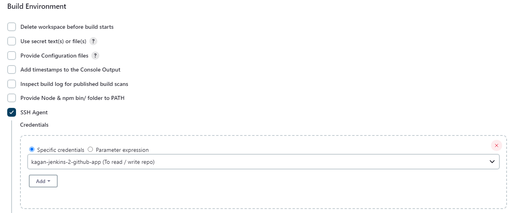

- [What is CI/ CD??](#what-is-ci-cd)
    - [Benefits of CI](#benefits-of-ci)
    - [Benefits of CD](#benefits-of-cd)
  - [Difference between CD and CDE (Continous Deployment)](#difference-between-cd-and-cde-continous-deployment)
- [What is Jenkins?](#what-is-jenkins)
  - [Why use Jenkins? Benefits of using Jenkins? Disadvantages?](#why-use-jenkins-benefits-of-using-jenkins-disadvantages)
    - [Benefits](#benefits)
    - [Disadvantages](#disadvantages)
  - [Stages of Jenkins](#stages-of-jenkins)
  - [What alternatives are there for Jenkins](#what-alternatives-are-there-for-jenkins)
- [Why build a pipeline? Business value?](#why-build-a-pipeline-business-value)
- [Create a general diagram of CI/CD](#create-a-general-diagram-of-cicd)
- [Understand SDLC workflow: plan, design, develop, deploy](#understand-sdlc-workflow-plan-design-develop-deploy)

# What is CI/ CD??

**CI**, or **Continous Integration**, refers to the practice of automating the integration of code changes from multiple contributors into a shared repository several times a day.

### Benefits of CI
- Early bug detection
- Reduced merge conflicts
- Automated testing
- Faster dev cycles

**CD**, or **Continous Development**, refers to the process of automatically delivering integrated code changes to testing, staging, and production environments after passing all relevant testing.

### Benefits of CD
- Faster, realiable releases
- Reduce manual errors
- Improve quality
- Increase developer productivity

## Difference between CD and CDE (Continous Deployment)
**CD** focuses on ensuring the app is always in a deployable state, where code can be automatically deployed to a staging environemnt but may require manual approval before going live, whereas **CDE** is about automating the process of releasing the code into production without requiring any manual approval after tests have passed.

# What is Jenkins?
Jenkins is an open-source automation tool used for CI/CD. It allows you to automate the building, testing, and deployment of applications by creating pipelines that automate repetitive tasks.

## Why use Jenkins? Benefits of using Jenkins? Disadvantages?
Jenkins ability to automate the CI/CD pipeline helps to reduce human error by automating repetitive tasks. 

### Benefits
- Extensible, with lots of plugins
- Open-source and supported by a large community
- Very scalable

### Disadvantages
- Learning curve
- Maintenance overhead, requiring updates and monitoring

## Stages of Jenkins
1. **Build**: Code is compiled or built.
2. **Test**: Automated tests are run to validate the code.
3. **Deploy**: Code is deployed to staging or production environments.
4. **Monitor**: Post-deployment, monitoring and feedback stages ensure the health of the deployed application.

## What alternatives are there for Jenkins
- GitLab CI/CD
- Azure DevOps
- Travis CL
- Team City (JetBrains)

# Why build a pipeline? Business value?
- **Increased efficiency**: Automation reduces the time spent on repetitive tasks like testing and deployment.
- **Faster time-to-market**: CI/CD pipelines enable faster, more reliable software releases, meeting market demands quickly.
- **Better quality assurance**: Automation in testing ensures higher product quality with fewer defects.
- **Consistency**: Pipelines standardize processes, ensuring consistent deployments and fewer production issues.
- **Improved developer experience**: Developers can focus on building features rather than manual integrations or deployments.

# Create a general diagram of CI/CD

# Understand SDLC workflow: plan, design, develop, deploy
1. **Plan**: Define the project goals, scope, and requirements. This includes gathering information from stakeholders to set clear objectives.
2. **Design**: Architect the solution, including software design, user interfaces, and database schemas.
3. **Develop**: The actual coding phase where developers implement the required features.
3. **Deploy**: The process of releasing the code into production, making it available to users.

