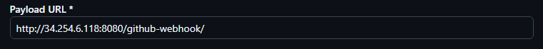
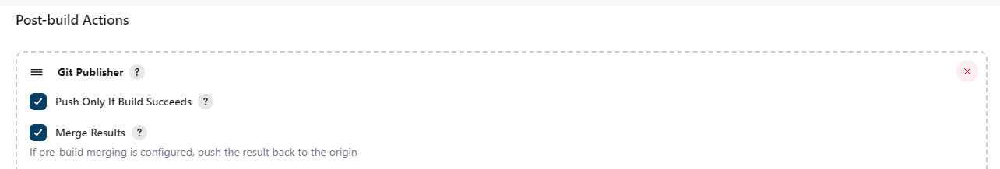
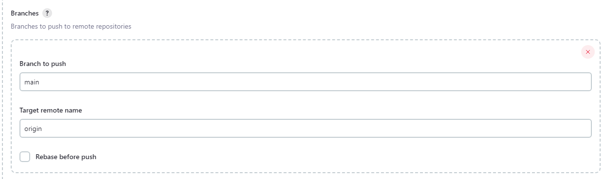

# What is a webhook?

a mechanism that allows external services or applications (such as GitHub, GitLab, Bitbucket, or any other tool) to trigger specific actions or workflows automatically in Jenkins.

## Webhook events you can trigger
**Push Event**: Trigger a build when code is pushed to a branch.

**Pull Request Event**: Trigger a build when a pull request is opened or updated.

**Tag Creation**: Trigger a build when a new tag is created in the repository.

**Branch Deletion**: Trigger a job when a branch is deleted (useful for cleanup tasks).

## Jenkins CI/CD Pipeline - 3 Jobs


### Jenkins 3 Jobs short explaination
1. **Developer** pushes code to the GitHub dev branch.
2. **Webhook**  triggers Jenkins when a change is made.
3. **Jenkins Job 1**: Tests the code in the dev branch.
4. **Jenkins Job 2**: Merges dev into main if tests are successful.
5. **Jenkins Job 3**: Deploys the code to the AWS EC2 instance.
- Throughout the process, **SSH authentication** is used for secure communication with **GitHub** and **EC2**.

# Jenkins Begins... Making a project
1. Select new item.
2. 


3. Enter a name for the project.


3. Select **Freestyle**. Click **Ok**.
4. Enable **Discard old builds** and set it to a max of **5**. This means that up to 5 build history are kept in the record at a time.

5. Let's add a build step.


6. Select execute shell, and in the input type `uname -a`.


7. Select build now on the right screen.


8. Once the build is complete, click the **build** to get more details. You can select the build number or date and time.


9.  Now select **Console Output** to see... the console output. It'll show the output from our `uname -a` command. It provides detailed information about the system's kernel and operating system.


We've repeated the process and made a second one, instead inputting `date` into the **execute shell**. Now, let's link two projects together.

10. Go to the job you want to start with.
11. Go to **Configure**.


12. Scroll down to **Post-Build Actions**.
13. Select **projects to build**.
14. Input the name of the project you want to trigger after this first job has run successfully.


15. Click **save**.
16. Select **build now** and wait for the build to finish running.
17. Select the build under the history. You'll see it has run both, but you can only view the output for the second build if you're in that build's section.


You can select the hyper link to go straight the other project.

## Making Job 1 in Jenkins
1. Follow the previous steps for creation from **1 - 4.**
2. Enable Github Project.
3. Enter the **HTTPS link** for the **repository** you wish to link.


### --> Source Code Management
1. select **Git** and enter your **SSH** repository link.
2. Add your credentials.
   1. For the **Kind** section, select **SSH Username with private key**.
   2. In **ID**, name it the same as the key.
   3. In description, write what the key is going to be used for.
   4. In the **Username** section, Ppaste the **ID** we just used.
   5. Under **Private Key**, Enable **Enter directly** and input your private key. 

*Note! The diagram below shows all steps excluding the **private key** insert, as it is **PRIVATE**. duh.*


1. Click **Add**.
2. Now, under the **credentials**, you can select the key you've added.

So far, the **Git** section should look like this:


3. Below that, under **Branches to build**, change it to `*/main`. Later, this'll be `dev`.

### --> Build Environment
4. Enable **Provide node and npm bin/ folder to PATH** and specify **NodeJS version 20**. We do this to allow Jenkins to run nodejs and npm commands necessary for testing.
  


### --> Build Steps
1. Add an **execute shell** build step, and insert the following commands:

```
cd app
npm install
npm test
```


2. Click save and you'll return to the job screen. 

### --> On the job screen...
1. Select **Build now** and await your evil machine's birth!!! You might have to do some waiting.
2. You can view the job by clicking the link to it under **build history**.
3. Click **Console Output** and you'll see it working in real time if it hasn't finished yet.


## Setting up the Webhook to trigger Job 1

1. Navigate to your GitHub repo's **settings**.
2. Click **Webhooks**.


1. **Add** in the **IP** of your Jenkins server, adding `/github-webhook/` to the end of it.



2. Click **Add Webhook**. Done. It's that simple! Now, we need to get the Jenkins side set up.

### --> Back to the configure screen of Job 1
1. Find **Branches to build** and input `*/dev`. 
2. Check **GitHub hook trigger for GITScm polling**.
3. Add add a **Build Other Projects** and select **your Job 2**, so that it will run if Job 1 is successful.


### --> The GitBash window for the directory
1. Create dev branch using `git branch dev`.
2. Switch to the dev branch using `git switch dev`.
3. Make a change, then perform a `git push` to test the trigger. If this works, a build will activate on **Jenkins** and it will run the build.

## Setting up Job 2 - Merge Job
1. Create a new project, following previous steps such as providing **GitHub** repo links and selecting your **SSH** key. 
2. Select **Git Publisher**.
3. Enable **Push Only if Build Succeeds**.
4. Enable **Merge Results**.



1. Under branches, for **branches to push**, input **main**. 
2. For **Target remote name**, input **origin**.



3. Ensure you have **SSH Agent** enabled and your key selected. It will need this for authentication.


4. Build the job and it will work!

## Setting up Job 3 - Deploy Job
1. Create a new project, following previous steps such as providing **GitHub** repo links and selecting your **SSH** key.
2. Enable **SSH Agent** under build environment as well, with the EC2 instance key selected.
3. Add a build step with the following commands inside:

```
# Define the IP address of the EC2 instance
EC2_IP="IP"  

# Copy the 'app' directory to the home directory of the EC2 instance
scp -r -o StrictHostKeyChecking=no app ubuntu@$EC2_IP:~/  

# SSH into the EC2 instance to execute commands remotely
ssh ubuntu@$EC2_IP <<EOF  

# Navigate to the 'app' directory on the EC2 instance
cd app  

# Stop all currently running PM2 processes
pm2 stop all  

# Install any missing Node.js dependencies for the app
npm install  

# Start the app using PM2
pm2 start app.js  
EOF 

```

### Manual Set Up
```
# Set EC2 instance variables
EC2_USER="ubuntu"
EC2_IP="IP"

# CD into app folder
cd app

# Install dependencies
npm install

# Add EC2 IP to known_hosts using ssh-keyscan
ssh-keyscan -H $EC2_IP >> ~/.ssh/known_hosts

# Copy the 'app' folder from Jenkins workspace to EC2 instance, copying recursively the directory and it's entire contents
scp -r $WORKSPACE/app/ $EC2_USER@$EC2_IP:/home/$EC2_USER

# SSH into EC2 and restart the app using PM2
ssh $EC2_USER@$EC2_IP << EOF # 
  sudo rsync -a /home/ubuntu/app/ /repo/app/
  cd /repo/app
  sudo -E pm2 restart app.js
EOF
```

We use EOF so it's inputted as if we were typing those lines directly into the terminal of the remote machine.
