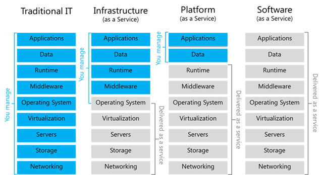
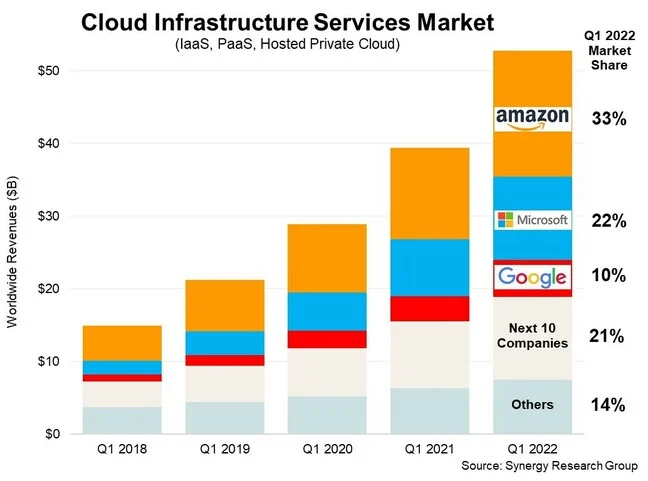

# Cloud Computing
- [Cloud Computing](#cloud-computing)
  - [1. How do we know if something is in the cloud?](#1-how-do-we-know-if-something-is-in-the-cloud)
  - [2. Differences between On-Prem and the Cloud?](#2-differences-between-on-prem-and-the-cloud)
  - [3. The 4 Deployment Models of Cloud:](#3-the-4-deployment-models-of-cloud)
  - [4. Types of Cloud Services:](#4-types-of-cloud-services)
  - [5. Advantages/Disadvantages of the Cloud for Businesses:](#5-advantagesdisadvantages-of-the-cloud-for-businesses)
    - [Advantages:](#advantages)
    - [Disadvantages:](#disadvantages)
  - [6. Difference Between OpEx vs CapEx:](#6-difference-between-opex-vs-capex)
  - [7. Is migrating to the cloud always cheaper?](#7-is-migrating-to-the-cloud-always-cheaper)
  - [8. Market Share - Cloud Trends:](#8-market-share---cloud-trends)
  - [9. What are the 3 largest Cloud providers known for?](#9-what-are-the-3-largest-cloud-providers-known-for)
  - [10. Which cloud provider might be the best? Why?](#10-which-cloud-provider-might-be-the-best-why)
  - [11. What do you usually pay for in the cloud?](#11-what-do-you-usually-pay-for-in-the-cloud)
  - [12. What are the 4 Pillars of DevOps, and how do they link into the Cloud?](#12-what-are-the-4-pillars-of-devops-and-how-do-they-link-into-the-cloud)
- [The Monolith vs 2 - Tier Architecture](#the-monolith-vs-2---tier-architecture)
  - [The Monolith](#the-monolith)
  - [2 Tier Architecture](#2-tier-architecture)
 
## 1. How do we know if something is in the cloud?
Cloud services are typically accessed over the internet, meaning the data or application isn't hosted locally. If you're accessing resources or apps without needing specific local hardware, it's likely cloud-based. They're also available on demand. 
 
## 2. Differences between On-Prem and the Cloud?
- **On-Prem**: Resources are hosted and managed on the company's own servers.
- **Cloud**: Resources are hosted on external servers, managed by cloud providers, and accessed via the internet.
 
**On-Prem:**
- Requires internal management of hardware and software.
- High upfront costs. 
- Physical proximity to resources. 

**On Cloud**
- Managed by the cloud provider.
- Lower initial costs, often subscription-based.
- Accessible from anywhere with internet access.

 
## 3. The 4 Deployment Models of Cloud:
- **Private Cloud**: Dedicated to a single organization, offering enhanced control and security. More secure, but expensive and complex.
- **Public Cloud**: Services provided over the internet and shared across multiple users. Cost-effective but less control over security.
- **Hybrid Cloud**: A mix of public and on-prem, allowing companies to maintain sensitive data on premise while leveraging the scalability of the publix cloud for other operations.
- **Multi-Cloud**: Use of multiple cloud services from different providers. Increased redundancy (meaning having backups when things fail) and flexibility.
 
## 4. Types of Cloud Services:
- **IaaS (Infrastructure as a Service)**: Provides virtualized computing resources over the internet.
- **PaaS (Platform as a Service)**: Offers hardware and software tools over the internet, typically for app development.
- **SaaS (Software as a Service)**: Delivers software applications via the internet, accessible through a browser.
  

| Service **Type** | **Example** | **Description** |
| ------------ | ------- | ----------- |
| IaaS | AWS EC2 | Provides virtual machines and storage. |
| PaaS | Google App Engine | Platform to develop and deploy apps. |
| SaaS | Dropbox | Ready-to-use applications accessible online. |
 
## 5. Advantages/Disadvantages of the Cloud for Businesses:
 
### Advantages:
- Scalability
- Cost-effective
- Access to advanced technologies
- Less maintenance
- Guranteed level of service with a pay-back scheme if not achieved

### Disadvantages:
- Security risk since you have no physical control
- Limited control
- Ongoing costs
 
## 6. Difference Between OpEx vs CapEx:
- **OpEx (Operational Expenditure)**: Ongoing costs for running services (e.g., cloud subscription).
- **CapEx (Capital Expenditure)**: Upfront investment in physical infrastructure (e.g., data centers).
- **Cloud**: Shifts costs from CapEx to OpEx, making costs more predictable but continuous.
 
## 7. Is migrating to the cloud always cheaper?
- While the cloud offers lower upfront costs, long-term costs can be higher due to recurring subscription fees, especially for large-scale operations.
- AWS has Trusted Advisor which is used to optimise costs.
- AWS has a pay-as-you-go model.

 
## 8. Market Share - Cloud Trends:
 
**Market Breakdown:**
1. AWS
2. Microsoft Azure
3. Google Cloud Platform
 
Market share breakdown:

 
## 9. What are the 3 largest Cloud providers known for?
 
- **AWS**: Known for its extensive service offerings and scalability.
- **Microsoft Azure**: Strong in hybrid cloud solutions and integrations with enterprise tools.
- **Google Cloud Platform**: Popular for AI and data analytics.
 
## 10. Which cloud provider might be the best? Why?
The best cloud provider depends on your needs:
- **AWS** for versatility and global reach.
- **Azure** for seamless enterprise integrations.
- **Google Cloud** for cutting-edge AI/ML services.
 
## 11. What do you usually pay for in the cloud?
- Storage
- Compute power
- Data transfer (Egress: Out)
- Additional services like security, databases, and networking
 
## 12. What are the 4 Pillars of DevOps, and how do they link into the Cloud?
1. **Collaboration**: Cloud enables team collaboration through shared resources.
2. **Automation**: Cloud platforms allow for automated scaling and deployment.
3. **Continuous Integration/Delivery**: Cloud environments facilitate seamless CI/CD pipelines.
4. **Monitoring**: Cloud providers offer integrated monitoring tools for proactive issue detection.

# The Monolith vs 2 - Tier Architecture

## The Monolith
A monolithic architecture is an all-in-one approach where all components of an application—such as user interface, business logic, and data access—are part of a single, tightly-coupled codebase or deployment.

Characteristics:

- **Single Codebase**: Built and deployed as one unit.
- **Tightly Coupled**: Components depend on one another.
- **Simple Development**: Easier to develop and deploy initially.
- **Single Deployment**: Updates require redeploying the entire application.

Advantages:

- **Easier Development**: Small teams can build the entire system.
- **Simple Deployment**: Straightforward as it’s one unit.
- **Performance**: Faster internal communication.

Disadvantages:

- **Scalability**: Difficult to scale; must scale the whole app.
- **Maintenance**: Harder to maintain as complexity grows.
- **Flexibility**: Hard to introduce new technologies.
- **Risk of Failure**: A failure can impact the entire system.

## 2 Tier Architecture
In a 2-tier architecture, the application is divided into two layers: the client-side (frontend) and the server-side (backend). The server typically manages business logic and database interactions.

Characteristics:

**Client-Server Model**: Frontend and backend are separate.
**Direct Database Access**: Client communicates directly with the database.
**Decoupling**: UI and backend run independently.

Advantages:

**Separation of Concerns**: Easier to update frontend or backend.
**Better Scalability**: Scale backend independently.
**Maintainability**: Issues can be resolved without disrupting the client.

Disadvantages:

**Network Dependency**: Performance relies on network speed.
**Latency**: Increased communication latency compared to a monolith.
**Complexity**: More complex due to separate client and server components.