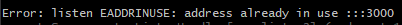
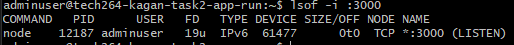

- [File Ownership With Linux](#file-ownership-with-linux)
  - [Why is managing file ownership important?](#why-is-managing-file-ownership-important)
  - [What is the command to view file ownership?](#what-is-the-command-to-view-file-ownership)
  - [What permissions are set when a user creates a file or directory? Who does file or directory belong to?](#what-permissions-are-set-when-a-user-creates-a-file-or-directory-who-does-file-or-directory-belong-to)
  - [Why does the owner, by default, not recieve X permissions when they create a file?](#why-does-the-owner-by-default-not-recieve-x-permissions-when-they-create-a-file)
  - [What command is used to change the owner of a file or directory?](#what-command-is-used-to-change-the-owner-of-a-file-or-directory)
- [Managing File Permissions](#managing-file-permissions)
  - [Does being the owner of a file mean you have full permissions on that file? Explain.](#does-being-the-owner-of-a-file-mean-you-have-full-permissions-on-that-file-explain)
  - [If you give permissions to the User entity, what does this mean?](#if-you-give-permissions-to-the-user-entity-what-does-this-mean)
  - [If you give permissions to the Group entity, what does this mean?](#if-you-give-permissions-to-the-group-entity-what-does-this-mean)
  - [If you give permissions to the Other entity, what does this mean?](#if-you-give-permissions-to-the-other-entity-what-does-this-mean)
  - [You give the following permissions to a file: User permissions are read-only, Group permissions are read and write, Other permissions are read, write and execute. You are logged in as the user which is owner of the file. What permissions will you have on this file? Explain.](#you-give-the-following-permissions-to-a-file-user-permissions-are-read-only-group-permissions-are-read-and-write-other-permissions-are-read-write-and-execute-you-are-logged-in-as-the-user-which-is-owner-of-the-file-what-permissions-will-you-have-on-this-file-explain)
  - [Here is one line from the ls -l. Work everything you can about permissions on this file or directory.](#here-is-one-line-from-the-ls--l-work-everything-you-can-about-permissions-on-this-file-or-directory)
- [Managing File Permissions Using Numeric Values](#managing-file-permissions-using-numeric-values)
  - [What numeric values are assigned to each permission?](#what-numeric-values-are-assigned-to-each-permission)
  - [What value would assign read + write permissions?](#what-value-would-assign-read--write-permissions)
  - [What value would assign read, write and execute permissions?](#what-value-would-assign-read-write-and-execute-permissions)
  - [What value would assign read and execute permissions?](#what-value-would-assign-read-and-execute-permissions)
  - [Often, a file or directory's mode/permissions are represented by 3 numbers. What do you think 644 would mean?](#often-a-file-or-directorys-modepermissions-are-represented-by-3-numbers-what-do-you-think-644-would-mean)
- [Changing File Permissions](#changing-file-permissions)
  - [What command changes file permissions?](#what-command-changes-file-permissions)
  - [To change permissions on a file what must the end user be? (2 answers)](#to-change-permissions-on-a-file-what-must-the-end-user-be-2-answers)
  - [Give examples of some different ways/syntaxes to set permissions on a new file (named testfile.txt) to:](#give-examples-of-some-different-wayssyntaxes-to-set-permissions-on-a-new-file-named-testfiletxt-to)
    - [Set User to read, Group to read + write + execute, and Other to read and write only](#set-user-to-read-group-to-read--write--execute-and-other-to-read-and-write-only)
    - [Add execute permissions (to all entities)](#add-execute-permissions-to-all-entities)
    - [Take write permissions away from Group](#take-write-permissions-away-from-group)
    - [Use numeric values to give read + write access to User, read access to Group, and no access to Other.](#use-numeric-values-to-give-read--write-access-to-user-read-access-to-group-and-no-access-to-other)
- [Some Linux Commands](#some-linux-commands)
- [How to Write a Bash Script: provision.sh](#how-to-write-a-bash-script-provisionsh)
- [What is an environment variable and how do we make one?](#what-is-an-environment-variable-and-how-do-we-make-one)
- [Process Commands](#process-commands)
- [SCP command and how it works](#scp-command-and-how-it-works)
- [Making a Database in Azure - MongoDB](#making-a-database-in-azure---mongodb)
- [To connect our DB to our app...](#to-connect-our-db-to-our-app)
- [Reverse Proxy](#reverse-proxy)
- [How many services can use a port?](#how-many-services-can-use-a-port)
  - [What error do you get when you try to run another instance of the Sparta app? Take a screenshot of it + add to your documentation.](#what-error-do-you-get-when-you-try-to-run-another-instance-of-the-sparta-app-take-a-screenshot-of-it--add-to-your-documentation)
  - [How to fix it - document how to fix it (i.e. re-run the app)](#how-to-fix-it---document-how-to-fix-it-ie-re-run-the-app)
  - [Find out the Linux command which allows you to find out the process using port 3000](#find-out-the-linux-command-which-allows-you-to-find-out-the-process-using-port-3000)
- [Run Sparta app in the background](#run-sparta-app-in-the-background)
  - [Work out ways to both run, stop and re-start the app in the background (besides using the "\&" at the end of the command):](#work-out-ways-to-both-run-stop-and-re-start-the-app-in-the-background-besides-using-the--at-the-end-of-the-command)
    - [One way should use pm2](#one-way-should-use-pm2)
    - [If time: One other way (can you find another package manager do it like pm2?)](#if-time-one-other-way-can-you-find-another-package-manager-do-it-like-pm2)
    - [You should have already used "\&" at the end the command to run the app in the background - document the issue with using this method when it comes to stopping/re-starting the app](#you-should-have-already-used--at-the-end-the-command-to-run-the-app-in-the-background---document-the-issue-with-using-this-method-when-it-comes-to-stoppingre-starting-the-app)
- [Automate configuration of nginx reverse proxy](#automate-configuration-of-nginx-reverse-proxy)
    - [Research how setup the reverse proxy with a single Bash command (or as few commands as possible) so that it can be used for automating the process later in a Bash script Hint: Research Linux commands that can be used to replace line(s) or strings within a text file.](#research-how-setup-the-reverse-proxy-with-a-single-bash-command-or-as-few-commands-as-possible-so-that-it-can-be-used-for-automating-the-process-later-in-a-bash-script-hint-research-linux-commands-that-can-be-used-to-replace-lines-or-strings-within-a-text-file)


# File Ownership With Linux

## Why is managing file ownership important?
File ownership determines who can read, modify, or execute a file or directory.
- revents unauthorized access to sensitive data.

- Ensures that users have the correct level of permissions to perform necessary operations.
- Helps maintain system stability by restricting critical system files to trusted users like root or administrators.
- Prevents accidental modifications or deletions by non-privileged users

## What is the command to view file ownership?
To view file ownership, you can use the `ls` command with the `-l` option to display detailed information about files, including the owner and group.

## What permissions are set when a user creates a file or directory? Who does file or directory belong to?
**For files**: By default, files are created without execute permissions. 

**For directories**: Directories are created with execute permissions to allow navigation. 

By default, when a user creates a file or directory, it belongs to:
- The **user** who created the file.
- The **group** to which the user belongs (the user’s primary group).

Permissions can be checked using `umask`. 

## Why does the owner, by default, not recieve X permissions when they create a file?

When a file is created, it is assumed to be a regular file, which do not need permissiosn to be executed. **Scripts** (so they can be run as programs) and **binary files** (so they can be executed by the system) required execute permissions.

`chmod` can be used to change the permissions if the file is meant to be executed.

## What command is used to change the owner of a file or directory?
`chown` (change owner): Can be used to change the owneship of a file or directory.

`sudo chown newowner filename` : Used to change **owner** of a file

`sudo chown newowner:newgroup filename` : Used to change both **owner** and **group**.

# Managing File Permissions

## Does being the owner of a file mean you have full permissions on that file? Explain.

**No**, being the owner of a file does not automatically mean you have full permissions on the file. File permissions are controlled by three sets of permissions:
- User (owner).
- Group.
- Others (everyone else).

The owner's permissions examples can vary. If the owner has read `r` and write `w` permissions but not execute `x`, they can modify the file but cannot execute it as a program.

## If you give permissions to the User entity, what does this mean?
When you give permissions to the User entity, you are setting what the owner of that file or directory can do.

- The **user (owner)** is the person who created the file or directory by default, but this can be changed with the `chown` (change owner) command.
- Permissions for the user affect only that specific owner.

## If you give permissions to the Group entity, what does this mean?
When you give permissions to the Group entity, you're specifying what the members of that group can do with the file or directory.

- Every file or directory is associated with a **group**. By default, this is the primary group of the **user** who created the file.
- Members of the **group** can have different permissions from the **owner**.
- Permissions for the **group** affect all users who belong to that **group**.

## If you give permissions to the Other entity, what does this mean?
When you set permissions for the Other entity, you're controlling what all other users who are not part of the file’s owner or group can do.

- These permissions apply to any **user** who doesn't match the file's **owner** or **group**.
- It's the broadest category and typically has the most restricted permissions for security reasons.

## You give the following permissions to a file: User permissions are read-only, Group permissions are read and write, Other permissions are read, write and execute. You are logged in as the user which is owner of the file. What permissions will you have on this file? Explain.

You would only have have the **owner** permissions, as they take priority over **group** and **other** permissions. This means the **owner** will will **read-only**. 

## Here is one line from the ls -l. Work everything you can about permissions on this file or directory. 

`-rwxr-xr-- 1 tcboony staff  123 Nov 25 18:36 keeprunning.sh`

- `-rwxr-xr--` Represents a regular file `(-)`, followed by the **owner** - permissions `(rwx)`, then the **group** permissions `(r-x)` and lastly **other** permissions `(r--)`. 
- `1` indicates that there is one link to the file.
- `tcboony` is the user who owns the file. They have all permissions.
- `staff` is the group associated with the file. They have read and execute permissions.
- `123` is the file size in bytes.
- `Nov 25 18:36` is the last modification date and time of the file.
- `keeprunning.sh` is the name of the file.

# Managing File Permissions Using Numeric Values

## What numeric values are assigned to each permission?
The numeric values assigned to each permission are as follows:
- **Read (r)**: 4
- **Write (w)**: 2
- **Execute (x)**: 1
- **No permissions**: 0
 
## What value would assign read + write permissions?
To assign **read + write** permissions, you would add the numeric values for read and write:
- Read (4) + Write (2) = **6**

## What value would assign read, write and execute permissions?
To assign **read, write, and execute permissions**, you would add the numeric values for read, write and execute:
- Read (4) + Write (2) + Execute (1) = **7**

## What value would assign read and execute permissions?
To assign **read and execute permissions**, you would add the numeric values for read and execute:
Read (4) + Execute (1) = **5**

## Often, a file or directory's mode/permissions are represented by 3 numbers. What do you think 644 would mean?
Each digit represents the **owner**, **group** and **other**. 644 would mean that the **owner** has **read and write** permissions, while both the **group** and **other** have **read only** permissions.

# Changing File Permissions

## What command changes file permissions?
The command used to change file permissions in Linux is `chmod` (change mode).

## To change permissions on a file what must the end user be? (2 answers)
- The Owner: The **user** who owns the file can change its permissions.
- A Super user (Root): A **user** with administrative privileges (typically root) can change permissions on any file.

## Give examples of some different ways/syntaxes to set permissions on a new file (named testfile.txt) to:

### Set User to read, Group to read + write + execute, and Other to read and write only
- `chmod u=r,g=rwx,o=rw testfile.txt`

### Add execute permissions (to all entities)
- `chmod a+x testfile.txt`

### Take write permissions away from Group
- `chmod g-w testfile.txt`

### Use numeric values to give read + write access to User, read access to Group, and no access to Other.
- `chmod 640 testfile.txt`

# Some Linux Commands
- `touch` : Creates a new empty file or updates the timestamp of an existing file.
- `mv` : Moves or renames files and directories.
- `grep` : Searches for a pattern within files.
- `find` : Searches for files and directories in a directory hierarchy.
- `head` : Displays the first 10 lines of a file (or specified number of lines).
- `tail` : Displays the last 10 lines of a file (or specified number of lines)Give.
- `cat` : Used to concatenate and display the contents of files.
- `nano` : A simple, user-friendly text editor used in the terminal.
- `tree` : Used to display the directory structure of a path in a tree-like format.
- `uname` : Displays system information.
- `whoami` : Tells you who is logged in.
- `ps` : Displays current processes.
- `history` : Gives youl log of commands used.
  - `history -c` : Clears the history in memory for the current session.
  - `history -w` : Writes the cleared history to the .bash_history file, which effectively empties the history file.
- `ls -al` : Shows all files, as well the long format listing for more detailed information on each file / directory. A directory will appear blue.
- `curl` : Used to transfer data from or to a server using various network protocols, such as HTTP, HTTPS, FTP, and others. Very powerful tool.
- `wget` : Used to download files from the web.
- `file` : Used to see what the file type of specified file.
- `cp` : Copies a file.
- `rm` : Removes a file.
- `sudo` : Super user command input. 
  - `sudo apt update -y` : Makes sure the package information is up to date, but doesn't install anything. 
  - `sudo apt upgrade -y` : **Dangerous.** Installs packages which could break any work that requires particular versions. Should only be used at the start of a VM. 
- `cd /` : Changes the current working directory to the root directory.
- `sudo su` : Switches you to the superuser (root) account.
  - `exit` : Can be used to leave super user.
  - `sudo DEBIAN_FRONTEND=noninteractive (then rest of command)` : Helps avoid user prompting.

# How to Write a Bash Script: provision.sh
 
1. use `nano provision.sh` to begin creating your `provision.sh` file, which will host the script.
2. In the nano interface, write the following lines (be sure to write comments using `#` to help with understanding):
   1. `#!/bin/bash`, which is called "**shebang**". This specifies which interpreter should be used to execute the script - so this tells it to use the **Bash** script.
   2. `sudo apt update -y`
   3. `sudo apt upgrade -y`
   4. `sudo apt install -y nginx`
   5. `sudo systemctl restart nginx`
   6. `sudo systemctl enable nginx`
3. Save the script by clicking `CTRL+S`, then exit the script by clicking `CTRL+X` to return back to your regular linux CL.
4. Since the default **permissions** do not allow you to execute the script, use `chmod +x provision.sh` to add **execution** **permissions** to the file.
5. Run the script using `./provision.sh`.

```
#!/bin/bash

# Check for updates
sudo apt update -y

# Upgrades those checks
sudo apt upgrade -y

# Install nginx
sudo apt install -y nginx

sudo systemctl restart nginx
sudo systemctl enable nginx
```

# What is an environment variable and how do we make one?

An **environment variable** is a dynamic **variable** stored in a process environment. It is used to **pass** configuration information and settings to processes running in the system. These **variables** can influence the behavior of software and system components by providing information such as paths, user preferences, and system settings.

We create them so they can be used globally because we want a particular tool or piece of software that will need to use the environment variable we set. 

- To view these, we can use the command `printenv`. 
- We can view a certain environment variable by using `printenv VARIABLENAME`. 
- To set a **variable**, we can use `VARIABLENAME=data`. This is a **shell variable**. To ensure this worked, we could use `echo $VARIABLENAME`, which would then output the `data` value. **Note** that this is **NOT** the same as an **enviornment variable**.
- To set an **environment variable**, we can use `export VARIABLENAME=data`, Which would then display it if we used `printenv MYNAME`. If we were to log out, the created **environment variable** would disappear as it is not **persistent**.
- If we were to set our **environment variable** inside of the hidden `.bashrc`, it would be visible to the user (admin) across sessions, making it **persistent**. **Note** that `.bashrc` is unique to the user. We can do this by using `nano .bashrc` and writing `export VARIABLENAME=data` in the file.

# Process Commands

- `ps` - to check user processes, `ps aux` - to check a lot of processes.
- `top` - to check CPU usage, `Ctrl + M` for memory, `Ctrl + N` for descending order of PID, `Ctrl + P` to go back to the CPU usage.
- `sleep 3` to sleep for 3 seconds in the foreground - To stop this `Ctrl + Z` or `Ctrl + C`.
- `sleep 5000 &` (this will give you an Process ID output) to tick in the background and not engage the terminal - To stop this `kill -1 <PID>` (`PID`: Process ID) (64 kill signals and -1 is the lightest).
- `kill <PID>` can be used on its own and is the same as `-15` (default - terminate).
- `kill -9 <PID>` is for brute force kill but this can leave zombie instances (instances still running in the memory with no parent process that can manage it and then needs to be manually killed).

You **must** be careful not to `kill` important processes, such as `init` as it can cause system crashes. 

You **must** also avoid not to `kill` parents of groups because you can be left with **zombie children / processes** - processes that continue to occupy a slot in the process table. 

# SCP command and how it works

`scp -i /path/to/your/private_key -r /path/to/local/directory username@remote_ip:/path/to/remote/destination/`

`scp` :
- This is the command used to securely copy files or directories between a local machine and a remote machine over SSH.

`-i ~/path/to/your/private_key` :
- `-i` : This option specifies the identity file (private key) to use for authentication.
- `~/path/to/your/private_key` : This is the path to your private SSH key used to authenticate with the remote server. The ~ represents the home directory of the current user.

`-r` : 
- This option indicates that you want to copy directories recursively. It allows you to copy all files and subdirectories within the specified directory.

`"/path/to/local/directory"` : 
- This is the source path of the directory you want to copy from your local machine. 
- The quotes are used to ensure that the path is treated as a single argument, which is especially useful if there are spaces in the path.

`username@remote_ip`:
- `username` : This is the username you will use to log in to the remote server.
- `remote_ip` : This is the IP address of the remote server (your VM).

`:/path/to/remote/destination/` :
- Replace /path/to/remote/destination/ with the path where you want to copy the files on the remote server.

# Making a Database in Azure - MongoDB

`sudo apt-get install gnupg curl` :
- `gnupg` : This is the GNU Privacy Guard, a tool for encrypting files and managing keys. It's often used for securely managing software repositories, verifying signatures, and other cryptographic functions.

1. Download PGP:
```
curl -fsSL https://www.mongodb.org/static/pgp/server-7.0.asc | \
   sudo gpg -o /usr/share/keyrings/mongodb-server-7.0.gpg \
   --dearmor
```
This command downloads the PGP (Pretty Good Privacy) public key for MongoDB version 7.0 and converts it to a .gpg file format using gpg. The resulting key is then stored in /usr/share/keyrings/ for use in authenticating MongoDB packages during installation. It ensures the packages are coming from a trusted source.

2. Register MongoDB to the system:
```
echo "deb [ arch=amd64,arm64 signed-by=/usr/share/keyrings/mongodb-server-7.0.gpg ] https://repo.mongodb.org/apt/ubuntu jammy/mongodb-org/7.0 multiverse" | sudo tee /etc/apt/sources.list.d/mongodb-org-7.0.list`
```
This command registers the MongoDB 7.0 repository to your system, ensuring that MongoDB packages will be fetched from the official source and verified with the correct GPG key during installation.

3. Run update:
```
sudo DEBIAN_FRONTEND=noninteractive apt update -y
```
Running sudo apt update is necessary to update the package lists from all configured repositories.

4. Install MongoDB components:
```
sudo DEBIAN_FRONTEND=noninteractive apt-get install -y mongodb-org=7.0.6 mongodb-org-database=7.0.6 mongodb-org-server=7.0.6 mongodb-mongosh=2.1.5 mongodb-org-mongos=7.0.6 mongodb-org-tools=7.0.6
```
This command installs specific versions of MongoDB components (version 7.0.6 for MongoDB and 2.1.5 for the MongoDB shell) in a non-interactive mode.

5. Status check:
```
sudo systemctl status mongod
```
Check the status of mongod. It will not be active. 

6. Start up:
```
sudo systemctl start mongod
```
Starts mongod. If you then re-run status, it will read as active.

7. Change bindIp:
```
sudo nano /etc/mongo.conf
```
Nanos into the mongo configuration file and locate `bindIp`. Replace whatever is there with `0.0.0.0`. Allows connections from any IP. If not changed, it's accessible by only the local host.

8. Restart: 
```
sudo systemctl restart mongod
```
This applies the changes we made in the config file.

9. Check if it's enabled:
```
sudo systemctl is-enabled mongod
```
It should read as disabled, so we will enable it.

10. Enable it:
```
sudo systemctl enable mongod
```
This will enable MongoDB, which then should be enabled on our VMs whenever we boot it up.

# To connect our DB to our app...

1. Open a new GitBash window and CD into app directory.
```
export DB_HOST=mongodb://DBPRIVATEIP:PORT/posts
```
This will connect via our VMs private IP. 

2. Set the environment variable.
```
printenv DB_HOST
```

3. Install 
```
npm install
```

4. Start

```
npm start
```

We can then access the app page via the IP in the **Connect** tab of Azure.

# Reverse Proxy
Route client requests to one or more backend servers, allowing you to expose it on a public IP and port. Hides the port which is better for security.

1. We go to the `nginx.conf` by using `sudo nano /etc/nginx/sites-available/nginx.conf`, as we do not have permissions to edit it without super user.`

2. Locate this:
```
    location / {
        proxy_pass http://localhost:3000;  # Ensure this is the correct port
```
After locating location (har har), we replace what's inside with this line. Redirects to the local lost, which is the machine - this has the app on it.

3. Then we use `sudo systemctl restart nginx` to apply these changes.

# How many services can use a port?
## What error do you get when you try to run another instance of the Sparta app? Take a screenshot of it + add to your documentation.



You get the error because you are trying to get a second app instance to use port 3000 but it's already in use by the first app instance.

## How to fix it - document how to fix it (i.e. re-run the app)
We could locate the port and possibly kill it in order to free up the port. 

## Find out the Linux command which allows you to find out the process using port 3000
We can use the command `lsof -i :3000` to find the process using **port 3000**.
`lsof` stands for **L**i**s**t **O**pen **F**iles. the `-i` is the **Network Connections Filter**. This flag tells `lsof` to list related files to network connections. We then specify `:3000` to search for what process is using it.



# Run Sparta app in the background

## Work out ways to both run, stop and re-start the app in the background (besides using the "&" at the end of the command):

### One way should use pm2
`pm2` : A production process manager that allows you to run your apps in the background, keep them alive (restart automatically if they crash), monitor performance, and handle logs. 

`pm2 start npm -- start` : Tells PM2 to start a new process using the npm command to execute the start script defined in your package.json. It launches your Node.js application in the background

`pm2 stop npm` :  If you have multiple processes managed by PM2 that were started with the npm -- start, you can stop them all using this command. This effectively halts the application, but does not remove it from PM2's process list.

`pm2 restart npm` :	This command restarts the running process associated with the npm command. PM2 will first stop the current instance and then start it again, ensuring any updates or changes are applied.

Don't forget to install PM2 in your script using `sudo npm install -g pm2`. The `-g` installs this globally, meaning we can access PM2 from any terminal window without needing to be in a specific project directory.

### If time: One other way (can you find another package manager do it like pm2?)
Research `forever`.

### You should have already used "&" at the end the command to run the app in the background - document the issue with using this method when it comes to stopping/re-starting the app

**Stopping the App**:
- To stop the application, you need to use the kill command followed by the PID, which requires additional steps and is error-prone.

**No Automatic Restarts**:
- If the application crashes, it will not be restarted automatically. You'll need to monitor the app yourself and manually restart it if needed.


# Automate configuration of nginx reverse proxy

### Research how setup the reverse proxy with a single Bash command (or as few commands as possible) so that it can be used for automating the process later in a Bash script Hint: Research Linux commands that can be used to replace line(s) or strings within a text file.

`sudo sed -i 's|try_files $uri $uri/ =404;|proxy_pass http://localhost:3000;|' /etc/nginx/sites-available/default` 

`'s|...|...|'` :
- This is the syntax for a substitution command in sed.
The s stands for substitute. The syntax is generally s/pattern/replacement/.
The | character is used as a delimiter for the parts of the substitution command instead of the usual /. This is useful when the pattern or replacement string contains slashes, making it easier to read.

