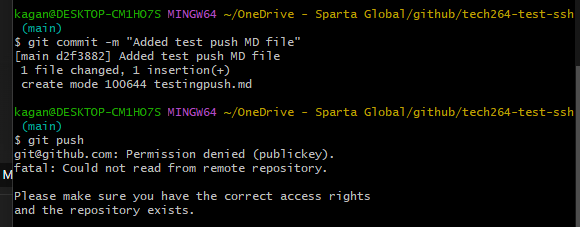

# Linking GitHub to a key
1. Generate a new SSH key. This can be found in the [Azure Notes](../azure/azure_notes.md) under `Steps to Create an SSH Key Pair (Using GitBash)`.
2. Print the **public** key using `cat`. This will be given to GitHub.
3. Navigate to your **Settings** on GitHub.
4. Find **SSH Keys and GPG keys** and add **New SSH key**. 
5. Name the key appropriately.
6. Insert what you printed and save.

### --> On your Terminal Window
1. Input ``` eval `ssh-agent -s` ``` (yes, including the backticks inside!) to start the SSH agent.
2. `ssh-add` your `private key`. This will add your identity.
3. **Test** your connection to GitHub using `ssh -T git@github.com`.
4. You will either get a prompt to then type `yes`, or it will say you're successfuly authenticated. This works **ANYWHERE** in your directory.

## --> CD into your github folder
1. Make a new directory for your GitHub repo in your github folder.
2. CD into this new directory.

### --> Make a GitHub Repo
1. Once created, change quick setup option from **HTTPS** to **SSH**.
2. Follow the GitHub instructions on the page, ensuring that the GitHub link does **NOT** start with **HTTPS**. 

# For if time push task
