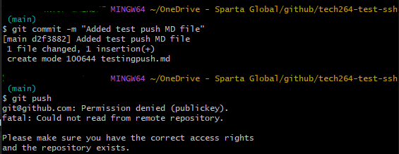

# Linking GitHub to a key
1. Generate a new SSH key. This can be found in the [Azure Notes](../azure/azure_notes.md) under `Steps to Create an SSH Key Pair (Using GitBash)`.
2. Print the **public** key using `cat`. This will be given to GitHub.
3. Navigate to your **Settings** on GitHub.
4. Find **SSH Keys and GPG keys** and add **New SSH key**. 
5. Name the key appropriately.
6. Insert what you printed and save.

### --> On your Terminal Window
1. Input ``` eval `ssh-agent -s` ``` (yes, including the backticks inside!) to start the SSH agent, configuring the **CURRRENT** POWER shell terminal to use it. This agent manages SSH keys during the session. It creates the process called `SSH_AGENT_PID`.
2. `ssh-add` your `private key`. This will add your identity.
3. **Test** your connection to GitHub using `ssh -T git@github.com`.
4. You will either get a prompt to then type `yes`, or it will say you're successfuly authenticated. This works **ANYWHERE** in your directory.

*Note! the SSH agent will no longer be accessible unless you restart the agent and re-add your key. This is because each new terminal session starts with a fresh environment and does not retain the environment variables.*



## --> CD into your github folder
1. Make a new directory for your GitHub repo in your github folder using `mkdir`.
2. CD into this new directory.

### --> Back on the GitHub page for the repo
1. Once created, change quick setup option from **HTTPS** to **SSH**.
2. Follow the GitHub instructions on the page, ensuring that the GitHub link does **NOT** start with **HTTPS**. 
3. Link the GitHub repo with your local machine's repo via the instructions (you will be using `git init`).

# Changing an EXISTING repo to HTTPS or SSH
1. Open GitBash.
2. Change the current working directory to your local project.
3. List your existing remotes in order to get the name of the remote you want to change using `git remote -v`.
4. Change your remote's URL with the `git remote set-url origin git@github.com:OWNER/REPOSITORY.git` command if it's **HTTPS** to **SSH**, and `git remote set-url origin https://github.com/OWNER/REPOSITORY.git` if it's **SSH** to **HTTPs**.
5. Verify that the remote URL has changed by using `git remote -v`
6. To verify further, attempt a `git pull` or `git push`. If you get an error, you've put the wrong link in.

## Why use either?

### HTTPS
- Often used by beginners
- Doesn't require SSH key management

### SSH
- More secure
- Requires SSH key management

*Note! If you switch to HTTPS, you will no longer require SSH authentication, meaning you will not need to restart your agent.*